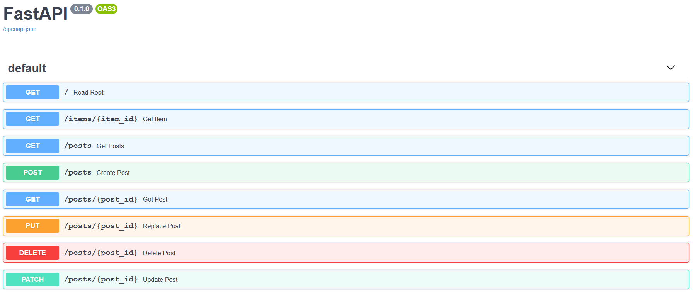

[](https://github.com/samwelkanda/blog-api/actions)
# blog-api

A documentation-first approach to building a RESTful API in Python. This project uses FastAPI. FastAPI is a modern, fast (high-performance), web framework for building APIs with Python 3.6+ based on standard Python type hints.

## System Requirements

* Python 3.6+
* Pipenv

## How to Run the Application

### Install Dependencies

```cmd
$ pipenv install
```

### Run the application

```cmd
$ pipenv run uvicorn sql_app.main:app --reload
```

### Check it

Open your browser at `http://127.0.0.1:8000/docs` to view the the automatic interactive API documentation (provided by Swagger UI)
And now, go to `http://127.0.0.1:8000/redoc`. You will see the alternative automatic documentation (provided by ReDoc):


